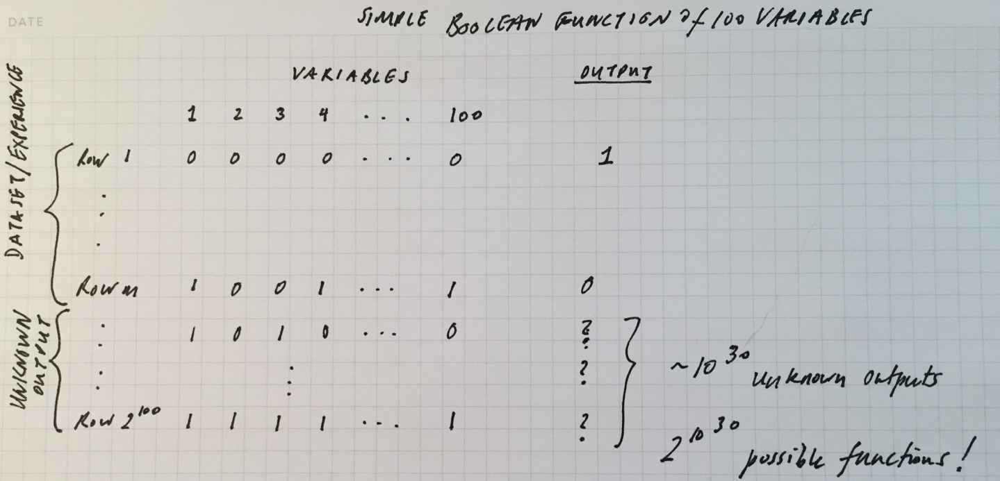

# How is Learning Even Possible?

We're surrounded by the successes of machine learning. Self driving cars, sophisticated translation, being able to tell Alexa what music we want.... These sucessses are real, yet for most of us (myself included), they seem magical. As the science fiction writer Arthur Clarke wrote in 1973, 

> "Any sufficiently advanced technology is indistinguishable from magic."

So it might strike you as bizarre or even somewhat stupid to ask if learning is possible. First, we humans do it really well as any new parent can attest. And second, we now have machines that do it really well too. So what's the problem?

Let's cut to the chase. For a machine to learn is for it to learn a function that looks in general like this:

$$f(X_{1}, X_{2}, X_{3}, \ldots, X_{m}) = Y$$

where $X_{1}$ through $X_{m}$ is a specific input and $Y$ is a specific output. The function $f$ is the function that is learned by using the entire dataset -- i.e., experience. The crux of learning is to be able to predict an outcome for an input that *has never been seen before*, namely, for the $X$s above.

So given a whole bunch of examples of inputs and their associated outputs (this is called "supervised learning"), the machine is able to construct the function $f$ that now will be able to *predict* the output for a heretofore never been seen input.

## No Free Lunch

Suppose $f$ is a Boolean function of 100 variables. In other words, each data point in the dataset has 100 inputs and a single output. To help the machine learn this function let's give it a trillion inputs and their associated outputs. 

By the way, while we've yet to see datasets in the trillions, we do routinely train machines on datasets that have many more than 100 inputs. It's not uncommon to have millions of inputs in deep learning systems that learn to recognize faces or to understand speech.

Our function is big but easy to characterize. Because it has 100 inputs, it must have $2^{100}$ possible configurations of these inputs. They'll look like this:

If I have a trillion known outputs on which to train my machine learning system, then I don't know the outputs of $2^{100} - 2^{12}$ of the function. There are $2^{(2^{100} - 2^{12})}$ different functions that will fit the data set! If you're keeping track, that's roughly $2^{10^{30}}$ different ways the function can be completed.

To summarize: Even with a trillion examples on which to train the machine, there remain $2^{10^{30}}$ possible functions from which the machine is supposed to learn a single function.

The bad news is that when there are so many possibilities, the chance of learning the right function is equal to the chance of randomly choosing a possible function. This thought was formalized by the computer scientist [David Wolpert in 1996](http://www.mitpressjournals.org/doi/abs/10.1162/neco.1996.8.7.1341#.WPOXLFMrLdQ) and the result falls into a set of theorems called *No Free Lunch* theorems. For a nice summary of the theorems and subsequent work, see [No Free Lunch Theorems](http://www.no-free-lunch.org/).

## How Then Does Learning Happen?

The simple answer to why machine learning is possible rests on something truly magical -- our world is such that not every one of the $2^{10^{30}}$ possible functions has the same probability of occurring. In fact, it turns out that some of these functions (a small handful) are extremely probable. This gives the right learning algorithm a huge advantage over simply flipping a coin. In other words, there's some kind of structure in this world and this saves us from just having to guess at random. The reason that a machine learning algorithm is successful is because it encodes the right assumptions about this structure.

As the computer scientist Pedro Domingos puts it, 

> "Machine learning is not magic; it can't get something from nothing. ...Learning is more like farming, which lets nature do most of the work. Farmers combine seeds with nutrients to grow crops. Learners combine knowledge with data to grow programs."

*Why* the world is this way is a deep question, one that I have no answer for. There are worlds we can imagine that are just like ours but where farming just doesn't work. Of course our world is not that kind of world. And given our world, the work of data scientists (metaphorically speaking) is to find the right seeds and the right nutrients to grow the crop that best suits the conditions.  
